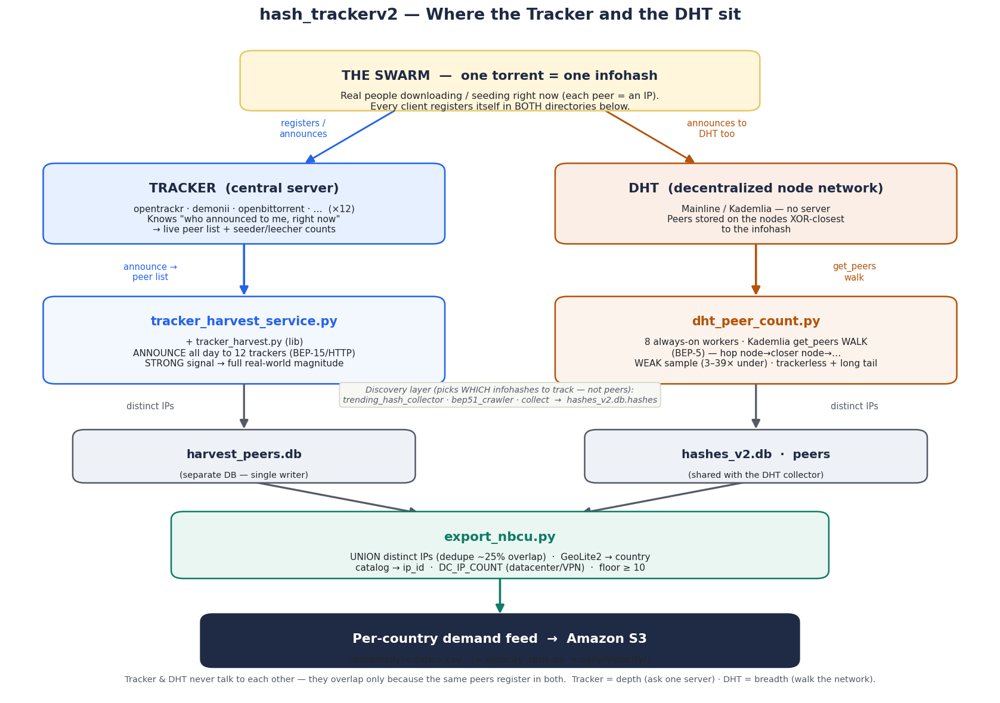

# Piracy Tracker — What It Does & How It Works

## The Goal

We want to know **which movies, TV shows, and anime are being pirated the most — and in which countries**.

This is the same intelligence that companies like NBCU, Warner Bros, and major studios pay for from firms like MUSO or Akamai. We built our **own** version on top of the BitTorrent network — an independent per-country demand feed so the team keeps this data after the third-party (NBCU) feed ends. NBCU is now a **validation benchmark**, not a dependency.

The data is stored at **country level per `ip_id`** — one record per title, per country, per day:

| ip_id | Title | Category | Country | IP_COUNT |
|---|---|---|---|---|
| series-Q… | The Boys S05 | Video: TV | United States | 8,086 |
| series-Q… | The Boys S05 | Video: TV | Other | 69,870 |
| film-Q… | Project Hail Mary | Video: Movie | United States | 6,791 |
| anime-21 | One Piece | Video: Anime | Other | 10,570 |

Rolled up into a ranked view (globally or filtered by any country):

| Rank | Title | Category | Total distinct IPs | Top markets |
|---|---|---|---|---|
| 1 | The Boys | Video: TV | 117,385 | US, GB, CA, AU |
| 2 | Project Hail Mary | Video: Movie | 88,346 | US, CA, GB |
| 3 | Witch Hat Atelier | Video: Anime | 24,339 | US, BR, FR |

**`ip_id`** = the Pantheon catalog ID that ties a torrent to a known title. We **map** it from the catalog (by `imdb_id`); we never mint it. Titles not in the catalog get a blank `ip_id` and `UNMAPPED=1`.
**IP_COUNT = distinct peer IPs** (people downloading/sharing) for that title × country × day. More = more piracy.
**Country filter** = slice the ranking by any of 14 named markets or "Other".

---

## What Is BitTorrent / DHT?

BitTorrent is the file-sharing tech behind piracy. Every torrent has a unique fingerprint called an **info_hash** (a 40-char code like `a1b2c3…`).

The **DHT** (Distributed Hash Table) is BitTorrent's built-in, trackerless directory — a global network of millions of nodes that track who has what. **Trackers** are the other directory: central servers a client "announces" to. We tap **both** to (1) discover hashes, (2) collect the peer IPs sharing each one, (3) geolocate those IPs to countries.

---

## Where the Tracker and the DHT sit (flow)



The **swarm** (the real peers) is the ground truth. The **tracker** and the **DHT** are
two *independent directories* that each know about it — they never talk to each other;
they overlap only because the same peers register in both (~25% of IPs appear in both).
We run one collector against each, then union them.

```
                THE SWARM  (one infohash = one torrent; each peer = an IP)
                 every client registers in BOTH directories ↓
     ┌───────────────────────────┴───────────────────────────┐
 ┌───▼───────────────┐                              ┌──────────▼──────────┐
 │ TRACKER (server)  │  announce → live peer list   │ DHT (node network)  │  get_peers WALK →
 │ opentrackr,demonii│  + seed/leech counts         │ peers on nodes      │  a sample of the swarm
 │ … ×12             │  STRONG (full magnitude)     │ XOR-closest to hash │  WEAK (3–39× under)
 └───┬───────────────┘                              └──────────┬──────────┘
     │ tracker_harvest_service.py (announce all day)           │ dht_peer_count.py (8 workers)
     ▼                                                          ▼
  harvest_peers.db  ─────────────┐          ┌──────────  hashes_v2.db (peers)
                                 ▼          ▼
                         export_nbcu.py — UNION distinct IPs (dedupe overlap)
                         + GeoLite2 country + catalog ip_id + DC_IP_COUNT + floor≥10
                                 ▼
                  per-country demand feed → S3   (+ velocity_rank.py → daily/velocity/)
```

- **Tracker = depth** (ask one server, near-complete live list). **DHT = breadth** (walk the network; reaches trackerless + long-tail swarms the trackers miss).
- A separate **discovery layer** (`trending_hash_collector` / `bep51_crawler` / `collect`) decides *which* infohashes to track → writes the worklist to `hashes_v2.db.hashes`. It does **not** find peers.

(See the rendered `00_flow_tracker_dht.png`, and slide 6 "End-to-End Flow" in the deck.)

---

## The Full Pipeline — Step by Step

```
STEP 1: DISCOVER HASHES
  trending_hash_collector.py  ←  TPB, EZTV, Nyaa, YTS, TMDB, AniList
                                 (also does TMDB/MAL enrichment of titles)
  bep51_crawler.py            ←  Raw DHT network scan (--filter-media keeps only
                                 media + resolves title/category at insert)
  collect.py                  ←  Jackett, 1337x, BitMagnet + built-in TMDB/MAL enrich
         │
         ▼
   hashes_v2.db  (SQLite — the master list of all hashes we track; WAL mode)

STEP 2: COUNT / HARVEST PEERS  (two layers)
  (a) dht_peer_count.py            ←  DHT sample — WEAK signal (undercounts 3–39×),
                                       but unique coverage: trackerless swarms +
                                       the long tail. 8 always-on workers + --new-only.
  (b) tracker_harvest_service.py   ←  Tracker announces — STRONG signal. Repeatedly
       (imports tracker_harvest.py)    asks each swarm's trackers "who's here?" and
                                       unions all distinct IPs across the day.
                                       THIS reaches full real-world magnitude.
         │                                   │
         ▼                                   ▼
   peers table in hashes_v2.db        harvest_peers.db  (separate DB; avoids WAL
                                       write-contention with the DHT collector)

STEP 3: CLEAN UP
  prune_dead_hashes.py        ←  Removes hashes nobody has downloaded for N days
  compact_peer_counts.py      ←  Rolls per-pass peer-count CSVs into partitioned Parquet

STEP 4: PUBLISH — outputs
  (a) export_nbcu.py          ←  PRIMARY: our own per-country distinct-IP demand feed
                                  (DHT ⊎ harvester union). 14 named countries + Other.
                                  Schema: TITLE, IP_ID, IMDB_ID, ANIME_ID, DATE,
                                  CATEGORY (Video: TV/Movie/Anime), COUNTRY_4,
                                  IP_COUNT, DC_IP_COUNT (datacenter/VPN share),
                                  UNMAPPED. → /data/daily/<date>.csv → S3.
  (b) velocity_rank.py        ←  COMPANION: day-over-day "fastest-rising / new-release"
                                  ranking. → /data/daily/velocity/<date>.csv → S3.
  (c) merge_and_upload.py     ←  LEGACY dashboard: DHT-only peer counts, CSV → S3 →
                                  Dashboard (4×/day). Weaker signal; kept for the
                                  existing dashboard only.
```

> **The independent feed = Step 2b (harvester) + Step 4a (`export_nbcu.py`).**
> See `07_tracker_harvest_service.md` and `08_export_nbcu.md`.

---

## Infrastructure — one US box

A **single US instance** (`YOUR_INSTANCE_ID`, us-east-1) runs everything:
discovery, the 8 DHT workers, the harvester, and all publish steps. State lives on
a dedicated `/data` EBS volume. **The former EU node is retired** (stopped
2026-05-30) — it only ever fed the legacy dashboard, never the demand feed.

The 8 always-on DHT workers split into two tiers:
- **Active tier** — `dht-peer-count{,-w1,-w2,-w3}` (4 workers, slices 0–3/7): hashes with ≥3 recent real peers, scanned every ~minute.
- **Dormant tier** — `dht-dormant{,-w1,-w2,-w3}` (4 workers, slices 0–3/4): the long tail, slower passes.
- **New tier** — `dht_peer_count.py --new-only` runs from cron (01:05/10:05/18:05) to baseline just-discovered hashes.

---

## How Hashes Are Discovered

1. **Trending (most reliable)** — `trending_hash_collector.py` scrapes TPB/EZTV/Nyaa/YTS + pulls TMDB trending and AniList top-500, matched against the Pantheon catalog (41K movies, 17K series, 28K anime).
2. **BEP-51 raw discovery (widest)** — `bep51_crawler.py` samples hashes straight off the DHT; `--filter-media` keeps only resolvable Movies/Series/Anime and drops junk.
3. **Targeted search** — `collect.py` searches indexers (Jackett/1337x/BitMagnet/apibay/YTS) for catalog titles and enriches them via TMDB/MAL.

---

## How Peer Counting Works (`dht_peer_count.py`)

For each hash, it runs an **iterative Kademlia `get_peers` walk** (`get_peers_by_country`): query the DHT nodes XOR-closest to the hash, collect peer IPs from their replies, follow the closer nodes they return for several rounds, then geolocate every IP via **GeoLite2-Country** → country code. Writes distinct IPs to the `peers` table (resilient, lock-retrying writer).

---

## The Schedule (UTC — consolidated root crontab + systemd)

| Time (UTC) | What runs | Purpose |
|---|---|---|
| 12:10 AM | `collect.py --skip-enrich` | Scrape new hashes |
| 12:30 AM | S3 catalog sync | Latest Pantheon catalog parquets |
| 1:00 / 10:00 / 6:00 PM | `trending_hash_collector.py` | Trending scrapes |
| 1:05 / 10:05 / 6:05 PM | `dht_peer_count.py --new-only` | Baseline new hashes |
| 1:30 AM | `compact_peer_counts.py` | CSV → partitioned Parquet |
| 2:00 AM | `collect.py` (enrich run) | TMDB/MAL enrichment |
| 2:30 AM | `bep51_crawler.py --filter-media` | 30-min DHT crawl, media-only |
| 3:00 AM | `s3_sync.sh` | Push CSVs, logs, DB backup |
| 4:20 / 4:20 PM | `wal_maintenance.sh` | Reclaim main-DB WAL if large (threshold-gated) |
| 4:30 AM (Sun) | `prune_dead_hashes.py` | Weekly dead-hash cleanup |
| 6:00 AM | TMDB trending (`--tmdb`) | Top movies/shows |
| 6:30 AM | AniList (`--anilist`) | Top 500 anime |
| **11:55 PM** | **`export-nbcu.timer` → demand feed + velocity → S3** | **the primary daily deliverable** |
| 05/11/17/23:00 | `merge-and-upload.timer` | Legacy dashboard CSV → S3 |
| 04/12/20:00 | `db-export-eu.timer` | (legacy) hashes export |
| every 5 min | `push_metric.py` | CloudWatch alive metric |
| every 15 min | `health_watchdog.py` | Whole-pipeline health → SNS |
| Continuous | 8 DHT workers + `tracker-harvest` (systemd) | Always-on counting/harvesting |

---

## The Databases

- **`hashes_v2.db`** (SQLite, WAL mode) — the main DB:
  - `hashes` — every torrent we track (hash, ip_id, title, raw_name, category, seeders, source, first/last_seen)
  - `peers` — distinct peer IPs per hash (the DHT collector writes here)
  - `titles` — Pantheon catalog mirror (ip_id, title, category, imdb_id, mal_id)
- **`harvest_peers.db`** (separate SQLite) — the harvester's peers, kept apart so its heavy writes don't bloat the main DB's WAL. ~4-day retention.

---

## Monitoring & Safety

- **`health_watchdog.py`** (every 15 min) — checks all services/timers, feed freshness, disk → consolidated SNS alert (with a midnight-rollover grace window).
- **`push_metric.py`** (every 5 min) — CloudWatch `DHTProcessAlive`.
- **`crash_notify.py`** — systemd `OnFailure` SNS handler for the DHT units.
- **`wal_maintenance.sh`** — threshold-gated WAL reclaim (the always-on workers can prevent the WAL from truncating; this resets it when it grows large).

---

## What "Good Numbers" Look Like

- **1,000+ IPs** = major release being actively pirated
- **100–999** = moderate interest · **10–99** = niche/older (10 = noise floor) · **<10** = dropped
- A brand-new movie starts near 0 on release day and jumps to thousands within 24–48h once a quality release (BluRay/WEB-DL) spreads. The **velocity feed** surfaces exactly these fast risers.

---

## Scripts Quick Reference

| Script | Plain English |
|---|---|
| `trending_hash_collector.py` | "Grab top torrents from TPB/EZTV/Nyaa/YTS/TMDB/AniList + enrich titles" |
| `bep51_crawler.py` | "Sample every hash off the DHT; keep the media ones" |
| `collect.py` | "Search indexers for our watchlist + TMDB/MAL enrich" |
| `dht_peer_count.py` | "For each hash, count who's downloading it and where (DHT walk)" |
| `tracker_harvest_service.py` / `tracker_harvest.py` | "Ask each swarm's trackers for peers, all day (the heavy lifter)" |
| `prune_dead_hashes.py` | "Remove hashes nobody is downloading anymore" |
| `compact_peer_counts.py` | "Roll per-pass CSVs into partitioned Parquet" |
| `export_nbcu.py` | "Build our per-country distinct-IP demand feed (the product)" |
| `velocity_rank.py` | "Rank fastest-rising / new-release titles day-over-day" |
| `merge_and_upload.py` | "Legacy dashboard feed (DHT-only) → S3" |
| `health_watchdog.py` / `wal_maintenance.sh` | "Keep the pipeline healthy and the DB lean" |

*(Retired: `search.py`, `enrich.py` — superseded by the matcher in `trending_hash_collector.py` and the enrichment built into `collect.py`; now in `junk/`.)*
